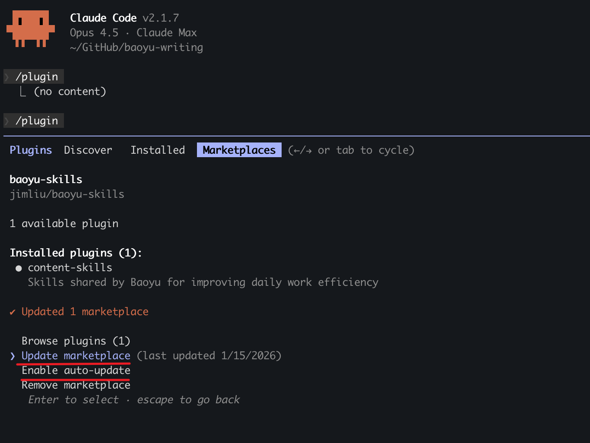
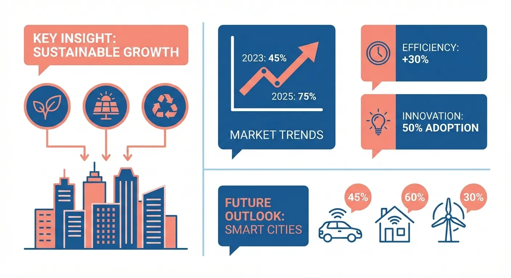
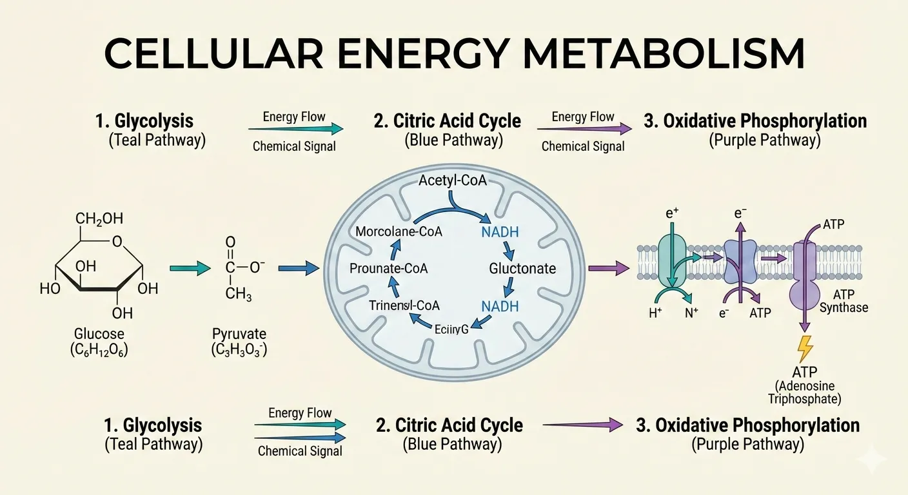

# super-creator

English | [中文](./README.zh.md)

AI-powered content generation skills for Claude Code.

> **Fork Notice**: This project is forked from [JimLiu/baoyu-skills](https://github.com/JimLiu/baoyu-skills). Original work by [@JimLiu](https://github.com/JimLiu).

## Architecture

`super-creator` follows a modular, intent-driven design:

1.  **Semantic Abstraction**: The `./sc-run` tool hides script paths and `bun`/`npx` logic from the Agent.
2.  **Progressive Disclosure**: `SKILL.md` files are kept minimal (<30 lines) to save Token context. Detailed documentation is stored in `references/*.md` and read by the Agent only when needed.
3.  **Self-Healing**: Scripts automatically handle common environment issues, such as stale Chrome CDP instances.

## Core CLI (`sc-run`)

This project provides a centralized runner to abstract path logic and runtime management.

```bash
# General Usage
./sc-run <skill-name> <script-name> [args...]

# Examples
./sc-run sc-imagine main --prompt "A futuristic lab"
./sc-run sc-xhs-images path/to/article.md
```

## Documentation

| Doc | Description |
|-----|-------------|
| [docs/quickstart.md](docs/quickstart.md) | 10-minute quickstart: Installation, API Key, and your first run |
| [docs/env-reference.md](docs/env-reference.md) | Reference for all environment variables and .env configuration |
| [docs/pipeline.md](docs/pipeline.md) | Full content creation flywheel (8 stages) |
| [docs/visuals.md](docs/visuals.md) | Decision table for visual skill selection |
| [docs/chrome-setup.md](docs/chrome-setup.md) | First-time configuration guide for Chrome CDP |

## Prerequisites

- Bun runtime: `brew install oven-sh/bun/bun` or `npm install -g bun`
- Google Chrome (full browser, not Chromium) — required for publishing and content fetching skills
- API Key for at least one image generation provider — required for visual skills (see [env-reference.md](docs/env-reference.md))

## Installation

### Quick Install (Recommended)

```bash
npx skills add hl85/super-creator
```

### Publish to ClawHub / OpenClaw

This repository now supports publishing each `skills/` directory as an individual ClawHub skill.

```bash
# Preview what would be published
./scripts/sync-clawhub.sh --dry-run

# Publish all changed skills from ./skills
./scripts/sync-clawhub.sh --all
```

ClawHub installs skills individually, not as one marketplace bundle. After publishing, users can install specific skills such as:

```bash
clawhub install sc-imagine
clawhub install sc-markdown-to-html
```

Publishing to ClawHub releases the published skill under `MIT-0`, per ClawHub's registry rules.

### Register as Plugin Marketplace

Run the following command in Claude Code:

```bash
/plugin marketplace add hl85/super-creator
```

### Install Skills

**Option 1: Via Browse UI**

1. Select **Browse and install plugins**
2. Select **super-creator**
3. Select the **super-creator** plugin
4. Select **Install now**

**Option 2: Direct Install**

```bash
# Install the marketplace's single plugin
/plugin install super-creator@super-creator
```

**Option 3: Ask the Agent**

Simply tell Claude Code:

> Please install Skills from github.com/hl85/super-creator

### Available Plugin

The marketplace now exposes a single plugin so each skill is registered exactly once.

| Plugin | Description | Includes |
|--------|-------------|----------|
| **super-creator** | Content generation, AI backends, and utility tools for daily work efficiency | All skills in this repository, organized below as Content Skills, AI Generation Skills, and Utility Skills |

## Update Skills

To update skills to the latest version:

1. Run `/plugin` in Claude Code
2. Switch to **Marketplaces** tab (use arrow keys or Tab)
3. Select **super-creator**
4. Choose **Update marketplace**

You can also **Enable auto-update** to get the latest versions automatically.



## Available Skills

Skills are organized into three categories:

### Content Skills

Content generation and publishing skills.

#### sc-xhs-images

Xiaohongshu (RedNote) infographic series generator. Breaks down content into 1-10 cartoon-style infographics with **Style × Layout** two-dimensional system.

```bash
# Auto-select style and layout
/sc-xhs-images posts/ai-future/article.md

# Specify style
/sc-xhs-images posts/ai-future/article.md --style notion

# Specify layout
/sc-xhs-images posts/ai-future/article.md --layout dense

# Combine style and layout
/sc-xhs-images posts/ai-future/article.md --style tech --layout list

# Direct content input
/sc-xhs-images 今日星座运势

# Non-interactive (skip all confirmations, for scheduled tasks)
/sc-xhs-images posts/ai-future/article.md --yes
/sc-xhs-images posts/ai-future/article.md --yes --preset knowledge-card
```

**Styles** (visual aesthetics): `cute` (default), `fresh`, `warm`, `bold`, `minimal`, `retro`, `pop`, `notion`, `chalkboard`

**Style Previews**:

| | | |
|:---:|:---:|:---:|
|  |  |  |
| cute | fresh | warm |
|  |  |  |
| bold | minimal | retro |
|  |  |  |
| pop | notion | chalkboard |

**Layouts** (information density):
| Layout | Density | Best for |
|--------|---------|----------|
| `sparse` | 1-2 pts | Covers, quotes |
| `balanced` | 3-4 pts | Regular content |
| `dense` | 5-8 pts | Knowledge cards, cheat sheets |
| `list` | 4-7 items | Checklists, rankings |
| `comparison` | 2 sides | Before/after, pros/cons |
| `flow` | 3-6 steps | Processes, timelines |

**Layout Previews**:

| | | |
|:---:|:---:|:---:|
|  |  |  |
| sparse | balanced | dense |
|  |  |  |
| list | comparison | flow |

#### sc-cover-image

Generate cover images for articles with 5 dimensions: Type × Palette × Rendering × Text × Mood. Combines 9 color palettes with 6 rendering styles for 54 unique combinations.

```bash
# Auto-select all dimensions based on content
/sc-cover-image path/to/article.md

# Quick mode: skip confirmation, use auto-selection
/sc-cover-image path/to/article.md --quick

# Specify dimensions (5D system)
/sc-cover-image path/to/article.md --type conceptual --palette cool --rendering digital
/sc-cover-image path/to/article.md --text title-subtitle --mood bold

# Style presets (backward-compatible shorthand)
/sc-cover-image path/to/article.md --style blueprint

# Specify aspect ratio (default: 16:9)
/sc-cover-image path/to/article.md --aspect 2.35:1

# Visual only (no title text)
/sc-cover-image path/to/article.md --no-title
```

**Five Dimensions**:
- **Type**: `hero`, `conceptual`, `typography`, `metaphor`, `scene`, `minimal`
- **Palette**: `warm`, `elegant`, `cool`, `dark`, `earth`, `vivid`, `pastel`, `mono`, `retro`
- **Rendering**: `flat-vector`, `hand-drawn`, `painterly`, `digital`, `pixel`, `chalk`
- **Text**: `none`, `title-only` (default), `title-subtitle`, `text-rich`
- **Mood**: `subtle`, `balanced` (default), `bold`

#### sc-article-illustrator

Smart article illustration skill with Type × Style two-dimension approach. Analyzes article structure, identifies positions requiring visual aids, and generates illustrations.

```bash
# Auto-select type and style based on content
/sc-article-illustrator path/to/article.md

# Specify type
/sc-article-illustrator path/to/article.md --type infographic

# Specify style
/sc-article-illustrator path/to/article.md --style blueprint

# Combine type and style
/sc-article-illustrator path/to/article.md --type flowchart --style notion
```

**Types** (information structure):

| Type | Description | Best For |
|------|-------------|----------|
| `infographic` | Data visualization, charts, metrics | Technical articles, data analysis |
| `scene` | Atmospheric illustration, mood rendering | Narrative, personal stories |
| `flowchart` | Process diagrams, step visualization | Tutorials, workflows |
| `comparison` | Side-by-side, before/after contrast | Product comparisons |
| `framework` | Concept maps, relationship diagrams | Methodologies, architecture |
| `timeline` | Chronological progression | History, project progress |

**Styles** (visual aesthetics):

| Style | Description | Best For |
|-------|-------------|----------|
| `notion` (default) | Minimalist hand-drawn line art | Knowledge sharing, SaaS, productivity |
| `elegant` | Refined, sophisticated | Business, thought leadership |
| `warm` | Friendly, approachable | Personal growth, lifestyle |
| `minimal` | Ultra-clean, zen-like | Philosophy, minimalism |
| `blueprint` | Technical schematics | Architecture, system design |
| `watercolor` | Soft artistic with natural warmth | Lifestyle, travel, creative |
| `editorial` | Magazine-style infographic | Tech explainers, journalism |
| `scientific` | Academic precise diagrams | Biology, chemistry, technical |

**Style Previews**:

| | | |
|:---:|:---:|:---:|
|  |  |  |
| notion | elegant | warm |
|  |  |  |
| minimal | blueprint | watercolor |
|  |  | |
| editorial | scientific | |

#### sc-post-to-wechat

Post content to WeChat Official Account (微信公众号). Two modes available:

**Image-Text (贴图)** - Multiple images with short title/content:

```bash
/sc-post-to-wechat 贴图 --markdown article.md --images ./photos/
/sc-post-to-wechat 贴图 --markdown article.md --image img1.png --image img2.png --image img3.png
/sc-post-to-wechat 贴图 --title "标题" --content "内容" --image img1.png --submit
```

**Article (文章)** - Full markdown/HTML with rich formatting:

```bash
/sc-post-to-wechat 文章 --markdown article.md
/sc-post-to-wechat 文章 --markdown article.md --theme grace
/sc-post-to-wechat 文章 --html article.html
```

**Publishing Methods**:

| Method | Speed | Requirements |
|--------|-------|--------------|
| API (Recommended) | Fast | API credentials |
| Browser | Slow | Chrome, login session |

**API Configuration** (for faster publishing):

```bash
# Add to .super-creator/.env (project-level) or ~/.super-creator/.env (user-level)
WECHAT_APP_ID=your_app_id
WECHAT_APP_SECRET=your_app_secret
```

To obtain credentials:
1. Visit https://developers.weixin.qq.com/platform/
2. Go to: 我的业务 → 公众号 → 开发密钥
3. Create development key and copy AppID/AppSecret
4. Add your machine's IP to the whitelist

**Browser Method** (no API setup needed): Requires Google Chrome. First run opens browser for QR code login (session preserved).

**Multi-Account Support**: Manage multiple WeChat Official Accounts via `EXTEND.md`:

```bash
mkdir -p .super-creator/post-to-wechat
```

Create `.super-creator/post-to-wechat/EXTEND.md`:

```yaml
# Global settings (shared across all accounts)
default_theme: default
default_color: blue

# Account list
accounts:
  - name: My Tech Blog
    alias: tech-blog
    default: false
    default_publish_method: api
    default_author: Author Name
    need_open_comment: 1
    only_fans_can_comment: 0
    app_id: your_wechat_app_id
    app_secret: your_wechat_app_secret
  - name: AI Newsletter
    alias: ai-news
    default_publish_method: browser
    default_author: AI Newsletter
    need_open_comment: 1
    only_fans_can_comment: 0
```

| Accounts configured | Behavior |
|---------------------|----------|
| No `accounts` block | Single-account mode (backward compatible) |
| 1 account | Auto-select, no prompt |
| 2+ accounts | Prompt to select, or use `--account <alias>` |
| 1 account has `default: true` | Pre-selected as default |

Each account gets an isolated Chrome profile for independent login sessions (browser method). API credentials can be set inline in EXTEND.md or via `.env` with alias-prefixed keys (e.g., `WECHAT_TECH_BLOG_APP_ID`).

### AI Generation Skills

AI-powered generation backends.

#### sc-imagine

AI SDK-based image generation using OpenAI, Azure OpenAI, Google, OpenRouter, DashScope (Aliyun Tongyi Wanxiang), MiniMax, Jimeng (即梦), Seedream (豆包), and Replicate APIs. Supports text-to-image, reference images, aspect ratios, custom sizes, batch generation, and quality presets.

```bash
# Basic generation (auto-detect provider)
/sc-imagine --prompt "A cute cat" --image cat.png

# With aspect ratio
/sc-imagine --prompt "A landscape" --image landscape.png --ar 16:9

# High quality (2k)
/sc-imagine --prompt "A banner" --image banner.png --quality 2k

# Specific provider
/sc-imagine --prompt "A cat" --image cat.png --provider openai

# Azure OpenAI (model = deployment name)
/sc-imagine --prompt "A cat" --image cat.png --provider azure --model gpt-image-1.5

# OpenRouter
/sc-imagine --prompt "A cat" --image cat.png --provider openrouter

# OpenRouter with reference images
/sc-imagine --prompt "Make it blue" --image out.png --provider openrouter --model google/gemini-3.1-flash-image-preview --ref source.png

# DashScope (Aliyun Tongyi Wanxiang)
/sc-imagine --prompt "一只可爱的猫" --image cat.png --provider dashscope

# DashScope with custom size
/sc-imagine --prompt "为咖啡品牌设计一张 21:9 横幅海报，包含清晰中文标题" --image banner.png --provider dashscope --model qwen-image-2.0-pro --size 2048x872

# MiniMax
/sc-imagine --prompt "A fashion editorial portrait by a bright studio window" --image out.jpg --provider minimax

# MiniMax with subject reference
/sc-imagine --prompt "A girl stands by the library window, cinematic lighting" --image out.jpg --provider minimax --model image-01 --ref portrait.png --ar 16:9

# Replicate
/sc-imagine --prompt "A cat" --image cat.png --provider replicate

# Jimeng (即梦)
/sc-imagine --prompt "一只可爱的猫" --image cat.png --provider jimeng

# Seedream (豆包)
/sc-imagine --prompt "一只可爱的猫" --image cat.png --provider seedream

# With reference images (Google, OpenAI, Azure OpenAI, OpenRouter, Replicate, MiniMax, or Seedream 5.0/4.5/4.0)
/sc-imagine --prompt "Make it blue" --image out.png --ref source.png

# Batch mode
/sc-imagine --batchfile batch.json --jobs 4 --json
```

**Options**:
| Option | Description |
|--------|-------------|
| `--prompt`, `-p` | Prompt text |
| `--promptfiles` | Read prompt from files (concatenated) |
| `--image` | Output image path (required) |
| `--batchfile` | JSON batch file for multi-image generation |
| `--jobs` | Worker count for batch mode |
| `--provider` | `google`, `openai`, `azure`, `openrouter`, `dashscope`, `minimax`, `jimeng`, `seedream`, or `replicate` |
| `--model`, `-m` | Model ID or deployment name. Azure uses deployment name; OpenRouter uses full model IDs; MiniMax uses `image-01` / `image-01-live` |
| `--ar` | Aspect ratio (e.g., `16:9`, `1:1`, `4:3`) |
| `--size` | Size (e.g., `1024x1024`) |
| `--quality` | `normal` or `2k` (default: `2k`) |
| `--imageSize` | `1K`, `2K`, or `4K` for Google/OpenRouter |
| `--ref` | Reference images (Google, OpenAI, Azure OpenAI, OpenRouter, Replicate, MiniMax, or Seedream 5.0/4.5/4.0) |
| `--n` | Number of images per request |
| `--json` | JSON output |

**Environment Variables** (see [Environment Configuration](#environment-configuration) for setup):
| Variable | Description | Default |
|----------|-------------|---------|
| `OPENAI_API_KEY` | OpenAI API key | - |
| `AZURE_OPENAI_API_KEY` | Azure OpenAI API key | - |
| `OPENROUTER_API_KEY` | OpenRouter API key | - |
| `GOOGLE_API_KEY` | Google API key | - |
| `GEMINI_API_KEY` | Alias for `GOOGLE_API_KEY` | - |
| `DASHSCOPE_API_KEY` | DashScope API key (Aliyun) | - |
| `MINIMAX_API_KEY` | MiniMax API key | - |
| `REPLICATE_API_TOKEN` | Replicate API token | - |
| `JIMENG_ACCESS_KEY_ID` | Jimeng Volcengine access key | - |
| `JIMENG_SECRET_ACCESS_KEY` | Jimeng Volcengine secret key | - |
| `ARK_API_KEY` | Seedream Volcengine ARK API key | - |
| `OPENAI_IMAGE_MODEL` | OpenAI model | `gpt-image-1.5` |
| `AZURE_OPENAI_DEPLOYMENT` | Azure default deployment name | - |
| `AZURE_OPENAI_IMAGE_MODEL` | Backward-compatible Azure deployment/model alias | `gpt-image-1.5` |
| `OPENROUTER_IMAGE_MODEL` | OpenRouter model | `google/gemini-3.1-flash-image-preview` |
| `GOOGLE_IMAGE_MODEL` | Google model | `gemini-3-pro-image-preview` |
| `DASHSCOPE_IMAGE_MODEL` | DashScope model | `qwen-image-2.0-pro` |
| `MINIMAX_IMAGE_MODEL` | MiniMax model | `image-01` |
| `REPLICATE_IMAGE_MODEL` | Replicate model | `google/nano-banana-pro` |
| `JIMENG_IMAGE_MODEL` | Jimeng model | `jimeng_t2i_v40` |
| `SEEDREAM_IMAGE_MODEL` | Seedream model | `doubao-seedream-5-0-260128` |
| `OPENAI_BASE_URL` | Custom OpenAI endpoint | - |
| `OPENAI_IMAGE_USE_CHAT` | Use `/chat/completions` for OpenAI image generation | `false` |
| `AZURE_OPENAI_BASE_URL` | Azure resource or deployment endpoint | - |
| `AZURE_API_VERSION` | Azure image API version | `2025-04-01-preview` |
| `OPENROUTER_BASE_URL` | Custom OpenRouter endpoint | `https://openrouter.ai/api/v1` |
| `OPENROUTER_HTTP_REFERER` | Optional app/site URL for OpenRouter attribution | - |
| `OPENROUTER_TITLE` | Optional app name for OpenRouter attribution | - |
| `GOOGLE_BASE_URL` | Custom Google endpoint | - |
| `DASHSCOPE_BASE_URL` | Custom DashScope endpoint | - |
| `MINIMAX_BASE_URL` | Custom MiniMax endpoint | `https://api.minimax.io` |
| `REPLICATE_BASE_URL` | Custom Replicate endpoint | - |
| `JIMENG_BASE_URL` | Custom Jimeng endpoint | `https://visual.volcengineapi.com` |
| `JIMENG_REGION` | Jimeng region | `cn-north-1` |
| `SEEDREAM_BASE_URL` | Custom Seedream endpoint | `https://ark.cn-beijing.volces.com/api/v3` |
| `SC_IMAGE_GEN_MAX_WORKERS` | Override batch worker cap | `10` |
| `SC_IMAGE_GEN_<PROVIDER>_CONCURRENCY` | Override provider concurrency | provider-specific |
| `SC_IMAGE_GEN_<PROVIDER>_START_INTERVAL_MS` | Override provider request start gap | provider-specific |

**Provider Notes**:
- Azure OpenAI: `--model` means Azure deployment name, not the underlying model family.
- DashScope: `qwen-image-2.0-pro` is the recommended default for custom `--size`, `21:9`, and strong Chinese/English text rendering.
- MiniMax: `image-01` supports documented custom `width` / `height`; `image-01-live` is lower latency and works best with `--ar`.
- MiniMax reference images are sent as `subject_reference`; the current API is specialized toward character / portrait consistency.
- Jimeng does not support reference images.
- Seedream reference images are supported by Seedream 5.0 / 4.5 / 4.0, not Seedream 3.0.

**Provider Auto-Selection**:
1. If `--provider` is specified → use it
2. If `--ref` is provided and no provider is specified → try Google, then OpenAI, Azure, OpenRouter, Replicate, Seedream, and finally MiniMax
3. If only one API key is available → use that provider
4. If multiple providers are available → default to Google

#### sc-gemini-web

Interacts with Gemini Web to generate text and images.

**Text Generation:**

```bash
/sc-gemini-web "Hello, Gemini"
/sc-gemini-web --prompt "Explain quantum computing"
```

**Image Generation:**

```bash
/sc-gemini-web --prompt "A cute cat" --image cat.png
/sc-gemini-web --promptfiles system.md content.md --image out.png
```

### Utility Skills

Utility tools for content processing.

#### sc-compress-image

Compress images to reduce file size while maintaining quality.

```bash
/sc-compress-image path/to/image.png
/sc-compress-image path/to/images/ --quality 80
```

#### sc-format-markdown

Format plain text or markdown files with proper frontmatter, titles, summaries, headings, bold, lists, and code blocks.

```bash
# Format a markdown file
/sc-format-markdown path/to/article.md

# Format with specific output
/sc-format-markdown path/to/draft.md
```

**Workflow**:
1. Read source file and analyze content structure
2. Check/create YAML frontmatter (title, slug, summary, coverImage)
3. Handle title: use existing, extract from H1, or generate candidates
4. Apply formatting: headings, bold, lists, code blocks, quotes
5. Save to `{filename}-formatted.md`
6. Run typography script: ASCII→fullwidth quotes, CJK spacing, autocorrect

**Frontmatter Fields**:
| Field | Processing |
|-------|------------|
| `title` | Use existing, extract H1, or generate candidates |
| `slug` | Infer from file path or generate from title |
| `summary` | Generate engaging summary (100-150 chars) |
| `coverImage` | Check for `imgs/cover.png` in same directory |

**Formatting Rules**:
| Element | Format |
|---------|--------|
| Titles | `#`, `##`, `###` hierarchy |
| Key points | `**bold**` |
| Parallel items | `-` unordered or `1.` ordered lists |
| Code/commands | `` `inline` `` or ` ```block``` ` |
| Quotes | `>` blockquote |

#### sc-markdown-to-html

Convert markdown files into styled HTML with WeChat-compatible themes, syntax highlighting, and optional bottom citations for external links.

```bash
# Basic conversion
/sc-markdown-to-html article.md

# Theme + color
/sc-markdown-to-html article.md --theme grace --color red

# Convert ordinary external links to bottom citations
/sc-markdown-to-html article.md --cite
```

## Environment Configuration

Some skills require API keys or custom configuration. Environment variables can be set in `.env` files:

**Load Priority** (higher priority overrides lower):
1. CLI environment variables (e.g., `OPENAI_API_KEY=xxx /sc-imagine ...`)
2. `process.env` (system environment)
3. `<cwd>/.super-creator/.env` (project-level)
4. `~/.super-creator/.env` (user-level)

**Setup**:

```bash
# Create user-level config directory
mkdir -p ~/.super-creator

# Create .env file
cat > ~/.super-creator/.env << 'EOF'
# OpenAI
OPENAI_API_KEY=sk-xxx
OPENAI_IMAGE_MODEL=gpt-image-1.5
# OPENAI_BASE_URL=https://api.openai.com/v1
# OPENAI_IMAGE_USE_CHAT=false

# Azure OpenAI
AZURE_OPENAI_API_KEY=xxx
AZURE_OPENAI_BASE_URL=https://your-resource.openai.azure.com
AZURE_OPENAI_DEPLOYMENT=gpt-image-1.5
# AZURE_API_VERSION=2025-04-01-preview

# OpenRouter
OPENROUTER_API_KEY=sk-or-xxx
OPENROUTER_IMAGE_MODEL=google/gemini-3.1-flash-image-preview
# OPENROUTER_BASE_URL=https://openrouter.ai/api/v1
# OPENROUTER_HTTP_REFERER=https://your-app.example.com
# OPENROUTER_TITLE=Your App Name

# Google
GOOGLE_API_KEY=xxx
GOOGLE_IMAGE_MODEL=gemini-3-pro-image-preview
# GOOGLE_BASE_URL=https://generativelanguage.googleapis.com/v1beta

# DashScope (Aliyun Tongyi Wanxiang)
DASHSCOPE_API_KEY=sk-xxx
DASHSCOPE_IMAGE_MODEL=qwen-image-2.0-pro
# DASHSCOPE_BASE_URL=https://dashscope.aliyuncs.com/api/v1

# MiniMax
MINIMAX_API_KEY=xxx
MINIMAX_IMAGE_MODEL=image-01
# MINIMAX_BASE_URL=https://api.minimax.io

# Replicate
REPLICATE_API_TOKEN=r8_xxx
REPLICATE_IMAGE_MODEL=google/nano-banana-pro
# REPLICATE_BASE_URL=https://api.replicate.com

# Jimeng (即梦)
JIMENG_ACCESS_KEY_ID=xxx
JIMENG_SECRET_ACCESS_KEY=xxx
JIMENG_IMAGE_MODEL=jimeng_t2i_v40
# JIMENG_BASE_URL=https://visual.volcengineapi.com
# JIMENG_REGION=cn-north-1

# Seedream (豆包)
ARK_API_KEY=xxx
SEEDREAM_IMAGE_MODEL=doubao-seedream-5-0-260128
# SEEDREAM_BASE_URL=https://ark.cn-beijing.volces.com/api/v3
EOF
```

**Project-level config** (for team sharing):

```bash
mkdir -p .super-creator
# Add .super-creator/.env to .gitignore to avoid committing secrets
echo ".super-creator/.env" >> .gitignore
```

## Customization

All skills support customization via `EXTEND.md` files. Create an extension file to override default styles, add custom configurations, or define your own presets.

**Extension paths** (checked in priority order):
1. `.super-creator/<skill-name>/EXTEND.md` - Project-level (for team/project-specific settings)
2. `~/.super-creator/<skill-name>/EXTEND.md` - User-level (for personal preferences)

**Example**: To customize `sc-cover-image` with your brand colors:

```bash
mkdir -p .super-creator/cover-image
```

Then create `.super-creator/cover-image/EXTEND.md`:

```markdown
## Custom Palettes

### corporate-tech
- Primary colors: #1a73e8, #4A90D9
- Background: #F5F7FA
- Accent colors: #00B4D8, #48CAE4
- Decorative hints: Clean lines, subtle gradients
- Best for: SaaS, enterprise, technical
```

The extension content will be loaded before skill execution and override defaults.

## Disclaimer

### sc-gemini-web

This skill uses the Gemini Web API (reverse-engineered).

**Warning:** This project uses unofficial API access via browser cookies. Use at your own risk.

- First run opens a browser to authenticate with Google
- Cookies are cached for subsequent runs
- No guarantees on API stability or availability

**Supported browsers** (auto-detected): Google Chrome, Chrome Canary/Beta, Chromium, Microsoft Edge

**Proxy configuration**: If you need a proxy to access Google services (e.g., in China), set environment variables inline:

```bash
HTTP_PROXY=http://127.0.0.1:7890 HTTPS_PROXY=http://127.0.0.1:7890 /sc-gemini-web "Hello"
```

## Credits

This project was inspired by and builds upon the following open source projects:

- [doocs/md](https://github.com/doocs/md) by [@doocs](https://github.com/doocs) — Core implementation logic for Markdown to HTML conversion
- [qiaomu-mondo-poster-design](https://github.com/joeseesun/qiaomu-mondo-poster-design) by [@joeseesun](https://github.com/joeseesun)（乔木） — Inspiration for the Mondo style

## License

MIT

## Star History

[](https://www.star-history.com/#hl85/super-creator&Date)
